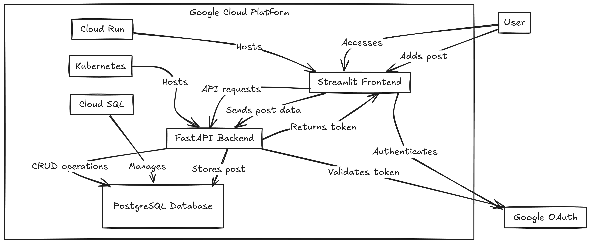

# FastAPI & Streamlit Blogging Application with Google OAuth
This repository hosts a SaaS application built with FastAPI and Streamlit, providing a blogging platform where users can log in or sign up using their Google accounts, create and manage blog posts, and access personal dashboards. This project is structured to be deployed on Google Cloud Platform (GCP) with Kubernetes and PostgreSQL.



## Table of Contents
- [Project Overview](#project-overview)
- [Features](#features)
- [Project Structure](#project-structure)
- [Getting Started](#getting-started)
  - [Prerequisites](#prerequisites)
  - [Local Setup](#local-setup)
- [Deployment on Google Cloud Platform](#deployment-on-google-cloud-platform)
    - [Database Deployment on Cloud SQL](#database-deployment-on-cloud-sql)
    - [Backend Deployment on Kubernetes](#backend-deployment-on-kubernetes)
        - [Create a project in GCP](#create-a-project-in-gcp)
        - [Install gcloud CLI](#install-gcloud-cli)
        - [Install gke-cloud-auth-plugin](#install-gke-cloud-auth-plugin)
        - [Using terraform to create GKE cluster](#using-terraform-to-create-gke-cluster)
        - [Install kubectl, kubectx and kubens](#install-kubectl-kubectx-and-kubens)
        - [Deploy nginx ingress controller](#deploy-nginx-ingress-controller)
        - [Deploy model serving service](#deploy-model-serving-service)

- [Contributing](#contributing)
- [License](#license)


## Project Overview
- Part 1: Google OAuth Login and Signup with FastAPI and Streamlit.
- Part 2: PostgreSQL Database Integration and CRUD Operations for User Posts. Deployment of the Backend on Kubernetes.
- Part 3: Deployment of the Frontend on Cloud Run.

## Features
- OAuth Authentication: Secure login and signup using Google OAuth.
- Personal Dashboard: Each user can access their dashboard to add, view, and manage blog posts.
- Post Management: CRUD functionality for blog posts stored in PostgreSQL.
- Scalable Deployment: Backend on Kubernetes and frontend on Cloud Run for scalable cloud hosting.

## Project Structure
- backend: Contains FastAPI backend with authentication (auth) and API endpoints (api).
    - apps: Contains FastAPI backend with authentication (auth) and API endpoints (api).
    - database: Models, schemas, and CRUD operations for PostgreSQL integration.
- frontend: Streamlit code for the user interface.

## Getting Started
### Prerequisites
- Python 3.9+
- Docker
- Google Cloud SDK (for deployment)
- GCP Project with billing enabled
- OAuth 2.0 Credentials for Google API

### Local Setup
Clone the Repository:
```
git clone https://github.com/yourusername/fastapi-streamlit-blog.git
cd fastapi-streamlit-blog
```

Environment Variables: Create a .env file in the root directory with the following:

```
GOOGLE_CLIENT_ID=your_google_client_id
GOOGLE_CLIENT_SECRET=your_google_client_secret
SECRET_KEY=your_session_secret_key


FRONTEND_URL=http://localhost:8501
BACKEND_URL=http://localhost:7000

SQLALCHEMY_DATABASE_URL=your_database_url
```
Then run the following commands to build and run the application:

```bash
docker-compose up -d --build --force-recreate
```

## Deployment on Google Cloud Platform

### Database Deployment on Cloud SQL

1. Create a Postgres Cloud SQL Instance by following these
[instructions](https://cloud.google.com/sql/docs/postgres/create-instance).

Note the __connection string__, __database user__, and __database password__ that you create.

2. Create a database for your application by following these
[instructions](https://cloud.google.com/sql/docs/postgres/create-manage-databases).

Note the __database name__.

3. Create a service account with the `Cloud SQL Client` IAM role by following these
[instructions](https://cloud.google.com/sql/docs/postgres/connect-external-app#4_if_required_by_your_authentication_method_create_a_service_account).

Download the JSON key for the service account to authenticate your connection for local development.

#### Running locally

To deploy the application locally on your machine:

1. Install the dependencies

    ```sh
    pip install -r requirements.txt
    ```

1. Fill in the `.env` file with your Cloud SQL specific values and path to service account JSON key.

    ```
    INSTANCE_CONNECTION_NAME="project-id:region:instance-name"
    DB_USER="my-db-user"
    DB_PASS="my-db-pass"
    DB_NAME="my-database"
    GOOGLE_APPLICATION_CREDENTIALS="path/to/keys.json"
    ```

1. Run the application

    ```sh
    cd backend
    uvicorn app.main:app --reload
    ```

The application is now running locally! Point your web browser at http://127.0.0.1:7000/docs to view the OpenAPI specs for it and to play around with making requests.

**Note:** Remember to remove the `--reload` when not in a development environment.
It helps a lot during development, but you shouldn't use it in production.


### Backend Deployment on Kubernetes
#### Create a project in GCP

First we need to create a project in [GCP](https://console.cloud.google.com/projectcreate?hl=vi&pli=1)

#### Install gcloud CLI
- gclound CLI can be installed in the following document

- Initialize gcloud CLI, and authenticate with GCP

```bash
gcloud init
```
- A pop-up will prompt us  to select your Google account. Select the account associated with your GCP registration and click `Allow`.

- Go back to your terminal, in which you typed `gcloud init`, type 1, and Enter.

- Select the GCE zone corresponding to europe-west4-a (in my case), then Enter.


#### Install gke-cloud-auth-plugin

In the next step, we'll install the GKE Cloud Authentication Plugin for the gcloud CLI tool. This plugin facilitates authentication with GKE clusters using the gcloud cli.

We can install the plugin using the following command:

`sudo apt-get install google-cloud-cli-gke-gcloud-auth-plugin`

This command will install the necessary plugin for authenticating with GKE clusters.

#### Using terraform to create GKE cluster

Terraform is a powerful infrastructure as code tool that allows us to define and provision infrastructure in a declarative manner. It helps to facilitate to automate the creation, modification, and deletion of infrastructure resources across various cloud providers.

To provision a GKE cluster using Terraform, follow these steps:

- We should update the invidual project ID, the corresponding GKE zone and its node machine. In my case, a gke cluster will be deployed in zone `europe-west4-a` with its node machine is: 

```bash 
cd terraform
terraform init  # Initialize Terraform in the directory
terraform plan  # Plan the configuration
terraform apply # Apply the configuration to create the GKE cluster
```

- A created cluster will be pop up in GKE UI (after 8 to 10 minutes)


- connect to gke cluster using `gcloud cli`

```bash
gcloud container clusters get-credentials <PROJECT_ID>-gke --zone europe-west4-a --project <PROJECT_ID>
```
- To view your highlighted cluster ID in the terminal, you can use the `kubectx` command.

#### Install kubectl, kubectx and kubens

Ensure that we have these tools to manage k8s cluster

What are kubectx and kubens?

- kubectx is a tool to switch between contexts (clusters) on kubectl faster.
- kubens is a tool to switch between Kubernetes namespaces (and configure them for kubectl) easily.

To install these tools, follow the instructions provided in the following section: https://github.com/ahmetb/kubectx#manual-installation-macos-and-linux.

In my case kubens and kubectl cli were saved in `usr/local/bin/`.

##### Deploy nginx ingress controller

An Ingress controller is a specialized load balancer for k8s enviroment, which accept traffic from outside the k8s platform, and load balance it to application containers running inside the platform. 

Deploy Nginx ingress controller in corresponding name space in following commands: 

```bash
cd helm/nginx-ingress    
kubectl create ns nginx-ingress # Create a K8s namespace nginx-ingress
kubens nginx-ingress            # switch the context to the newly created namespace 'nginx-ingress'
helm upgrade --install nginx-ingress-controller . # Deploy nginx Ingress 
```

Verify if the pod running in the specified namespace nginx-ingress
```bash
kubectl get pods -n nginx-ingress
```

- Get IP address of nginx-ingress
```bash
kubectl get svc -n nginx-ingress
```

Copy the external IP address to the `host` in deployment/templates/app-nginx-ingress.yaml file

##### Deploy model serving service

Deploy the FastAPI application container on GKE within the model-serving namespace. One replica will be created, corresponding to the one pod running the FastAPI application.

```bash
cd helm/deployment
kubectl create ns model-serving
kubens model-serving
helm upgrade --install bloggen .
```

- You can access the API in `NGINX_EXTERNAL_IP.nip.io/docs`

## Deployment on Cloud Run

The front-end can be deployed to [Cloud Run](https://cloud.google.com/run) through the following steps:

1. Build the container image

Replace `<PROJECT_ID>` with your Google Cloud Project ID.
```sh
gcloud builds submit --tag gcr.io/<PROJECT_ID>/bloggen-front
 
```

2. Deploy the service to Cloud Run
Replace environment variables with the correct values for your Cloud SQL
instance configuration as well as service account email of previously created service account.
```sh
gcloud run deploy bloggen-front --image gcr.io/<PROJECT_ID>/bloggen-front
```
If you are deploying for the first time, you will be prompted to enable the Cloud Run API. Enter `y` to enable the API. Another way to run the command is through the web console by navigating to Cloud Run and clicking on `Create Service`. Select the container image and click `Deploy`.

Take note of the URL output at the end of the deployment process.


# Contributing
Fork this repository.
Create a feature branch.
Commit your changes and open a pull request.
License
This project is licensed under the MIT License.

Feel free to reach out with questions or feedback. Enjoy building and scaling your blogging application on GCP!

# License
```
This project is licensed under the Apache License 2.0 - see the LICENSE file for details.
```


